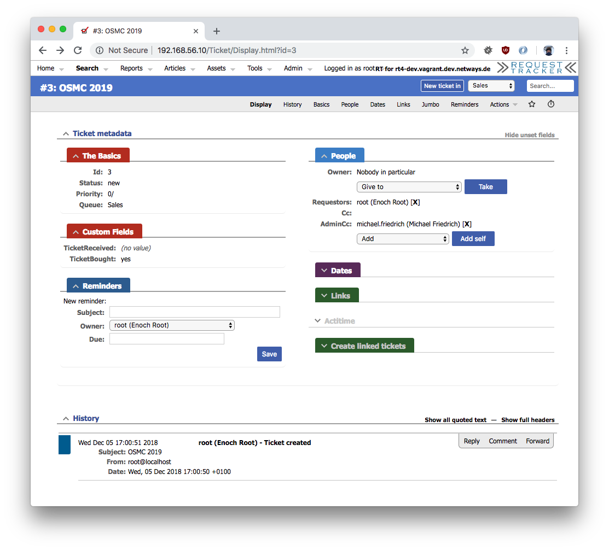

# RT-Extension-QuickAssign

#### Table of Contents

1. [About](#about)
2. [License](#license)
3. [Support](#support)
4. [Requirements](#requirements)
5. [Installation](#installation)
6. [Configuration](#configuration)

## About

Enable quick assign of users as AdminCC or Owner and
improve the layout with moving the "people" tab onto the
right upper corner.

* Quick assign of people as Owner or AdminCC (Configurable)

 

* Quick removal of people registered as AdminCc or Requestor
* Switched positions of ticket people and reminders




## License

This project is licensed under the terms of the GNU General Public License Version 2.

This software is Copyright (c) 2018 by NETWAYS GmbH [support@netways.de](mailto:support@netways.de).

## Support

For bugs and feature requests please head over to our [issue tracker](https://github.com/NETWAYS/rt-extension-quickassign/issues).
You may also send us an email to [support@netways.de](mailto:support@netways.de) for general questions or to get technical support.

## Requirements

- RT 4.4.2

## Installation

Extract this extension to a temporary location.

Git clone:

    cd /usr/local/src
    git clone https://git.netways.org/rt4/rt-extension-quickassign

Tarball download:

    cd /usr/local/src
    wget https://git.netways.org/rt4/rt-extension-quickassign/repository/master/archive.tar.gz
    tar xzf archive.tar.gz

Navigate into the source directory and install the extension. (May need root permissions.)

    perl Makefile.PL
    make
    make install

Edit your `/opt/rt4/etc/RT_SiteConfig.pm`

Add this line:

    Plugin('RT::Extension::Netways');

Clear your mason cache:

    rm -rf /opt/rt4/var/mason_data/obj

Restart your webserver.

## Configuration

**$QuickAssign_Enabled**

If enabled, shows the form controls to quickly assign people as AdminCc or Owner.

**$QuickAssign_Group**

Which group's members should be choosable when showing the quick assign form controls.

### Example

```
Set($QuickAssign_Enable, 1);
Set($QuickAssign_Group, 'netways');
```
