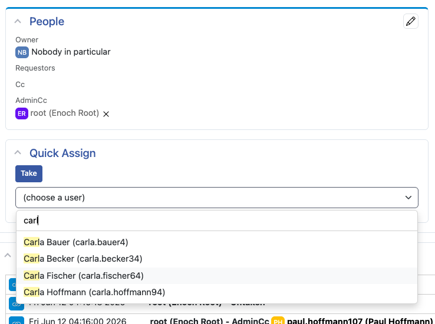
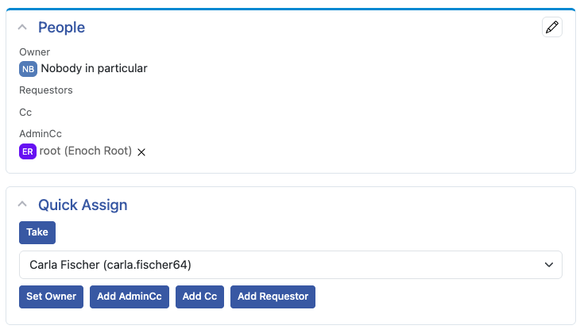
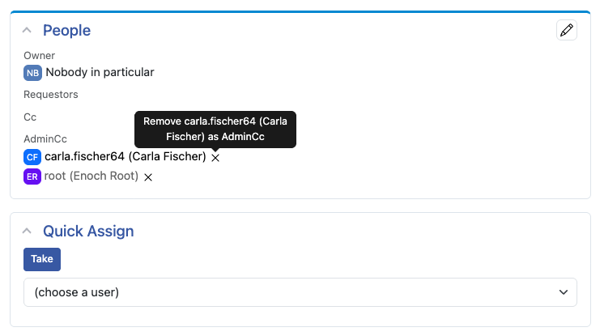

# RT-Extension-QuickAssign

#### Table of Contents

1. [About](#about)
2. [License](#license)
3. [Support](#support)
4. [Requirements](#requirements)
5. [Installation](#installation)
6. [Setup](#setup)
7. [Configuration](#configuration)
8. [Limitations](#limitations)

## About

Adds a **Quick Assign** widget to the ticket display page. It lets you
assign people as Owner, AdminCc, Cc or Requestor by picking them from the
members of a single configured group, instead of searching the whole user
database. The member list is rendered into the page, so filtering happens
instantly in the browser without autocomplete queries — useful on
installations with a very large number of contacts.

The widget also offers one-click **Take** and **Add me as AdminCc**
buttons, and each AdminCc, Cc and Requestor in the People box gets a
small remove button. All updates go through RT's standard ticket
update machinery (rights checks and notifications apply) and refresh
the People box in place without a page reload.

Type to filter the group members instantly:



Picking a user offers the roles that make sense for them:



Watchers are removed directly in the People box:



## License

This project is licensed under the terms of the GNU General Public License Version 2.

This software is Copyright (c) 2018-2026 by NETWAYS GmbH [support@netways.de](mailto:support@netways.de).

## Support

For bugs and feature requests please head over to our [issue tracker](https://github.com/NETWAYS/rt-extension-quickassign/issues).
You may also send us an email to [support@netways.de](mailto:support@netways.de) for general questions or to get technical support.

## Requirements

- RT 6

For RT 4.4 use the [v1.x releases](https://github.com/NETWAYS/rt-extension-quickassign/releases) of this extension.

## Installation

Extract this extension to a temporary location.

Git clone:

    cd /usr/local/src
    git clone https://github.com/NETWAYS/rt-extension-quickassign

Navigate into the source directory and install the extension. (May need root permissions.)

    perl Makefile.PL
    make
    make install

Edit your `/opt/rt6/etc/RT_SiteConfig.pm`

Add this line:

    Plugin('RT::Extension::QuickAssign');

Clear your mason cache:

    rm -rf /opt/rt6/var/mason_data/obj

Restart your webserver.

## Setup

The widget is not shown automatically. Add it to the ticket display page
layout: go to *Admin → Page Layouts*, edit the layout for class
`RT::Ticket`, page `Display`, and place the `QuickAssign` widget where you
want it (for example below the `People` widget).

## Configuration

**$QuickAssign_Group**

Name of the user-defined group whose members are offered in the Quick
Assign widget. The widget is hidden if this option is not set.

### Example

```
Set($QuickAssign_Group, 'Support');
```

Note that RT's usual rights apply: to be assigned as owner, the picked
user needs the `OwnTicket` right on the ticket's queue.

## Limitations

The remove buttons in the People box are only shown if the current user
has the `ModifyTicket` right. Group watchers do not get a remove button,
as RT core offers no hook for decorating them; remove them via the
People box inline edit instead.
